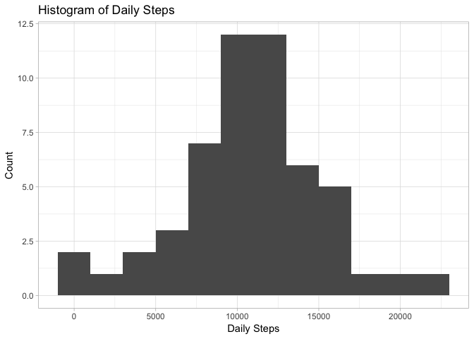
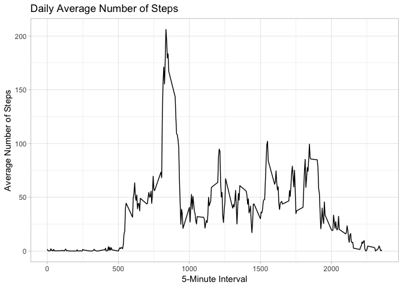
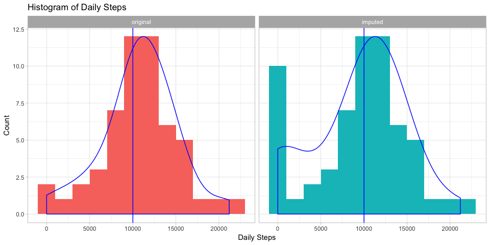
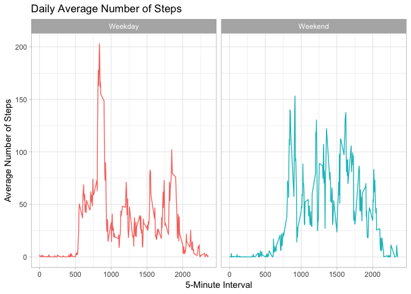

## Loading and preprocessing the data


```r
# Disable scientific notation

options(scipen = 1)

# Load libraries

library(tidyverse)
```

```
## ── Attaching packages ───────────────────────────────────────────── tidyverse 1.2.1 ──
```

```
## ✔ ggplot2 3.1.0     ✔ purrr   0.2.5
## ✔ tibble  2.0.1     ✔ dplyr   0.7.8
## ✔ tidyr   0.8.2     ✔ stringr 1.3.1
## ✔ readr   1.3.1     ✔ forcats 0.3.0
```

```
## ── Conflicts ──────────────────────────────────────────────── tidyverse_conflicts() ──
## ✖ dplyr::filter() masks stats::filter()
## ✖ dplyr::lag()    masks stats::lag()
```

```r
# Load data

if(!file.exists("activity.csv")) {
  unzip("activity.zip")
}

activity <- read_csv("activity.csv")
```

```
## Parsed with column specification:
## cols(
##   steps = col_double(),
##   date = col_date(format = ""),
##   interval = col_double()
## )
```

## What is mean total number of steps taken per day?

*Calculate the total number of steps taken per day.*


```r
activity.daily <- group_by(activity, date) %>% 
  summarize(steps = sum(steps))
```

*Histogram of steps per day.*


```r
ggplot(activity.daily, aes(steps)) + 
  geom_histogram(binwidth = 2000) +
  labs(title = "Histogram of Daily Steps",
       x     = "Daily Steps",
       y     = "Count") +
  theme_light()
```

```
## Warning: Removed 8 rows containing non-finite values (stat_bin).
```

<!-- -->

*Calculate mean and median of the total number of steps taken per day.*


```r
daily.steps.mean   <- mean(activity.daily$steps,   na.rm = T)
daily.steps.median <- median(activity.daily$steps, na.rm = T)
```

- Mean of total number of steps taken per day: 10766.19
- Median of the total number of steps taken per day: 10765

## What is the average daily activity pattern?

*Make a time series plot (i.e. type="l") of the 5-minute interval (x-axis) and the average number of steps taken, averaged across all days (y-axis).*


```r
activity.interval <- group_by(activity, interval) %>% 
  summarize(avg.steps = mean(steps, na.rm = T))

ggplot(activity.interval, aes(interval, avg.steps)) +
  geom_line() +
  labs(title = "Daily Average Number of Steps",
       x     = "5-Minute Interval",
       y     = "Average Number of Steps") +
  theme_light()
```

<!-- -->

*Which 5-minute interval, on average across all the days in the dataset, contains the maximum number of steps?*


```r
knitr::kable(top_n(activity.interval, 1, avg.steps))
```


 interval   avg.steps
---------  ----------
      835    206.1698

## Imputing missing values

*Calculate total number of rows with NAs.*


```r
summary(activity$steps)["NA's"]
```

```
## NA's 
## 2304
```

*Devise a strategy for filling in all of the missing values in the dataset.*


```r
# Impute NA as average between interval step counts

activity <- mutate(activity, steps.imputed = NA) %>% 
  select(steps, steps.imputed, date, interval)

for (i in 1:nrow(activity)) {
  
  # Identify rows with NA
  
  if(is.na(activity$steps[i])) {
    
    # Get previous step count
    # If no previous value exists (i.e. row 1), default to zero steps
    
    previous.row   <- (i - 1)
    previous.steps <- ifelse(previous.row < 1, 0,
                             activity$steps.imputed[previous.row])
    
    # Get next step count
    # If no next value exists (i.e beyond last row), default to previous steps
    
    next.row <- i + 1
    
    while(is.na(activity$steps[next.row] & next.row <= nrow(activity))) {
      next.row = next.row + 1
    }
    
    next.steps <- ifelse(next.row > nrow(activity),
                         previous.steps,
                         activity$steps[next.row])
    
    # Impute NA as average between values
    
    imputed.steps <- mean(c(previous.steps, next.steps))
    activity$steps.imputed[i] <- imputed.steps
    
  } else { activity$steps.imputed[i] <- activity$steps[i] }
}

rm(list = c("i",
            "imputed.steps",
            "next.row",
            "next.steps",
            "previous.row",
            "previous.steps"))
```


*Create a new dataset that is equal to the original dataset but with the missing data filled in.*


```r
activity.imputed <- select(activity, steps.imputed, date, interval) %>% 
  rename(steps = steps.imputed)
```

*Make a histogram of the total number of steps taken each day. Calculate and report the mean and median total number of steps taken per day. Do these values differ from the estimates from the first part of the assignment? What is the impact of imputing missing data on the estimates of the total daily number of steps?*


```r
# Prepare daily data for histogram comparing original and imputed data

activity.daily.imputed <- group_by(activity.imputed, date) %>% 
  summarize(steps = sum(steps))

# Join daily average data frames with original and imputed data

activity.daily.long <- full_join(activity.daily,
                                 activity.daily.imputed,
                                 by = c("date" = "date")) %>% 
  rename(original = steps.x, imputed = steps.y) %>% 
  gather(data, steps, -date) %>% 
  mutate(data = factor(data, levels = c("original", "imputed")))

# Create histogram with facets

ggplot(activity.daily.long, aes(steps, fill = data)) + 
  geom_histogram(binwidth = 2000) +
  geom_density(alpha  = 0, aes(y = ..scaled.. * 12),
               adjust = 1.5,
               color  = "blue",
               size = 0.5) +
  geom_vline(aes(xintercept = mean(steps, na.rm = T)),
             color    = "blue",
             size     = 0.5) +
  labs(title = "Histogram of Daily Steps",
       x     = "Daily Steps",
       y     = "Count") +
  facet_grid(. ~ data) +
  theme_light() +
  theme(legend.position = "none")
```

```
## Warning: Removed 8 rows containing non-finite values (stat_bin).
```

```
## Warning: Removed 8 rows containing non-finite values (stat_density).
```

<!-- -->

```r
# Spread daily data frame to create summary table

activity.daily.wide <- spread(activity.daily.long, data, steps) %>% 
  rename(original.steps = original, imputed.steps = imputed)

# Get mean and median summaries

knitr::kable(summary(activity.daily.wide)[c(3,4), c(2,3)])
```

     original.steps   imputed.steps 
---  ---------------  --------------
     Median :10765    Median :10395 
     Mean   :10766    Mean   : 9354 

- Mean and median values differ from the first part of the assignment—after imputation, mean and median values are smaller compared to the original data
- Imputing missing data estimated zeros for almost all of the NAs, slightly shifting the distribution to the left

## Are there differences in activity patterns between weekdays and weekends?

*Create a new factor variable in the dataset with two levels, "weekday" and "weekend", indicating whether a given date is a weekday or weekend day.*


```r
activity.weekdays.imputed <- mutate(activity, weekdays = weekdays(date)) %>% 
  
  # Create new column reclassifying M-F as weekday and S-S as weekend
  
  mutate(weekends = ifelse(weekdays == "Saturday" | weekdays == "Sunday",
                           "Weekend", "Weekday")) %>% 
  select(-c(steps, weekdays)) %>% 
  rename(steps    = steps.imputed,
         weekdays = weekends)
```

*Make a panel plot containing a time series plot of the 5-minute interval (x-axis) and the average number of steps taken, averaged across all weekday days or weekend days (y-axis).*


```r
# Calculate interval averages for weekday and weekend data

activity.weekdays.interval <- group_by(activity.weekdays.imputed,
                                       weekdays,
                                       interval) %>% 
  summarize(avg.steps = mean(steps, na.rm = T))

ggplot(activity.weekdays.interval, aes(interval, avg.steps, color = weekdays)) +
  geom_line() +
  facet_wrap(. ~ weekdays) +
  labs(title = "Daily Average Number of Steps",
       x     = "5-Minute Interval",
       y     = "Average Number of Steps") +
  theme_light() +
  theme(legend.position = "none")
```

<!-- -->
